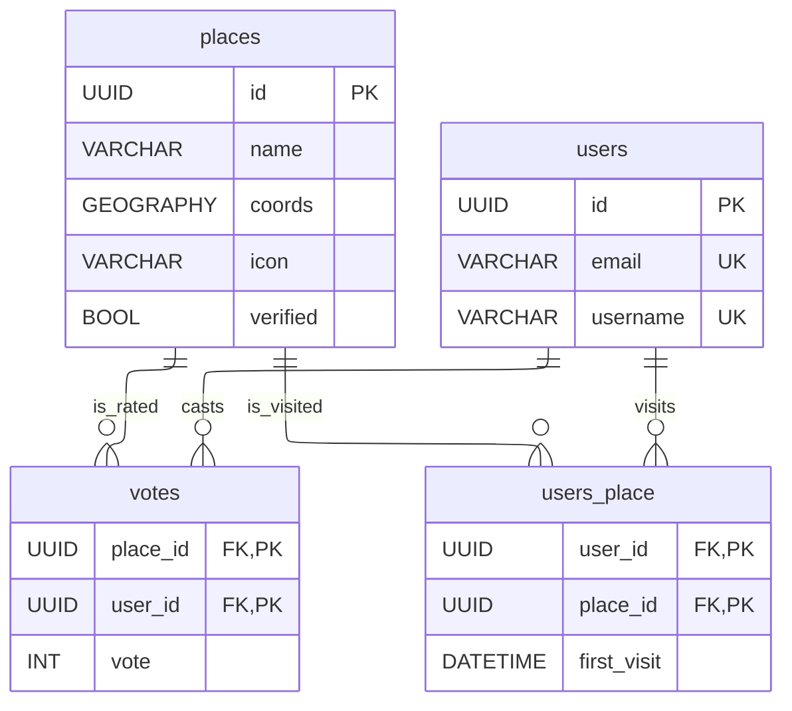

# Object model

for Database

```mermaid
---
config:
  layout: elk
---
erDiagram
    places {
        UUID id PK
        VARCHAR name
        GEOGRAPHY coords
        VARCHAR icon
        BOOL verified
    }

    votes {
        UUID place_id FK,PK
        UUID user_id FK,PK
        INT vote
    }

    users {
        UUID id PK
        VARCHAR email UK
        VARCHAR username UK
    }

    users_place {
        UUID user_id FK,PK
        UUID place_id FK,PK
        DATETIME first_visit
    }


users ||--o{ users_place : visits
users ||--o{ votes : casts

places ||--o{ users_place : is_visited
places ||--o{ votes : is_rated
```