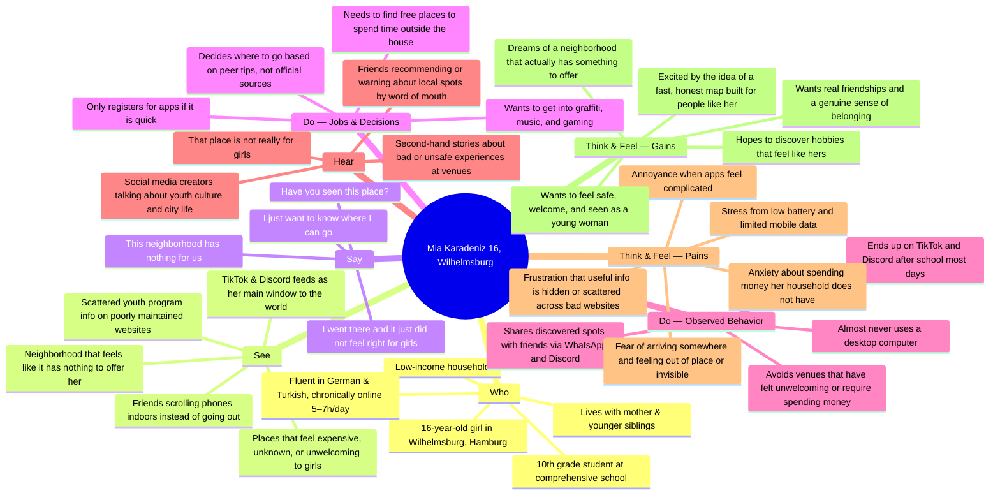

# Empathy Map: Prototypical User
**"A young person in Wilhelmsburg trying to find their place offline"**

```mermaid
---
config:
  layout: tidy-tree
---
mindmap
  root((Mia Karadeniz 16, Wilhelmsburg))
    Who
      16-year-old girl in Wilhelmsburg, Hamburg
      10th grade student at comprehensive school
      Lives with mother & younger siblings
      Low-income household
      Fluent in German & Turkish, chronically online 5–7h/day
    See
      Scattered youth program info on poorly maintained websites
      Friends scrolling phones indoors instead of going out
      Neighborhood that feels like it has nothing to offer her
      TikTok & Discord feeds as her main window to the world
      Places that feel expensive, unknown, or unwelcoming to girls
    Say
      I just want to know where I can go
      This neighborhood has nothing for us
      I went there and it just did not feel right for girls
      Have you seen this place?
    Do — Jobs & Decisions
      Needs to find free places to spend time outside the house
      Wants to get into graffiti, music, and gaming
      Decides where to go based on peer tips, not official sources
      Only registers for apps if it is quick
    Do — Observed Behavior
      Ends up on TikTok and Discord after school most days
      Shares discovered spots with friends via WhatsApp and Discord
      Avoids venues that have felt unwelcoming or require spending money
      Almost never uses a desktop computer
    Hear
      Friends recommending or warning about local spots by word of mouth
      That place is not really for girls
      Social media creators talking about youth culture and city life
      Second-hand stories about bad or unsafe experiences at venues
    Think & Feel — Pains
      Fear of arriving somewhere and feeling out of place or invisible
      Frustration that useful info is hidden or scattered across bad websites
      Anxiety about spending money her household does not have
      Annoyance when apps feel complicated
      Stress from low battery and limited mobile data
    Think & Feel — Gains
      Wants real friendships and a genuine sense of belonging
      Hopes to discover hobbies that feel like hers
      Dreams of a neighborhood that actually has something to offer
      Wants to feel safe, welcome, and seen as a young woman
      Excited by the idea of a fast, honest map built for people like her
```