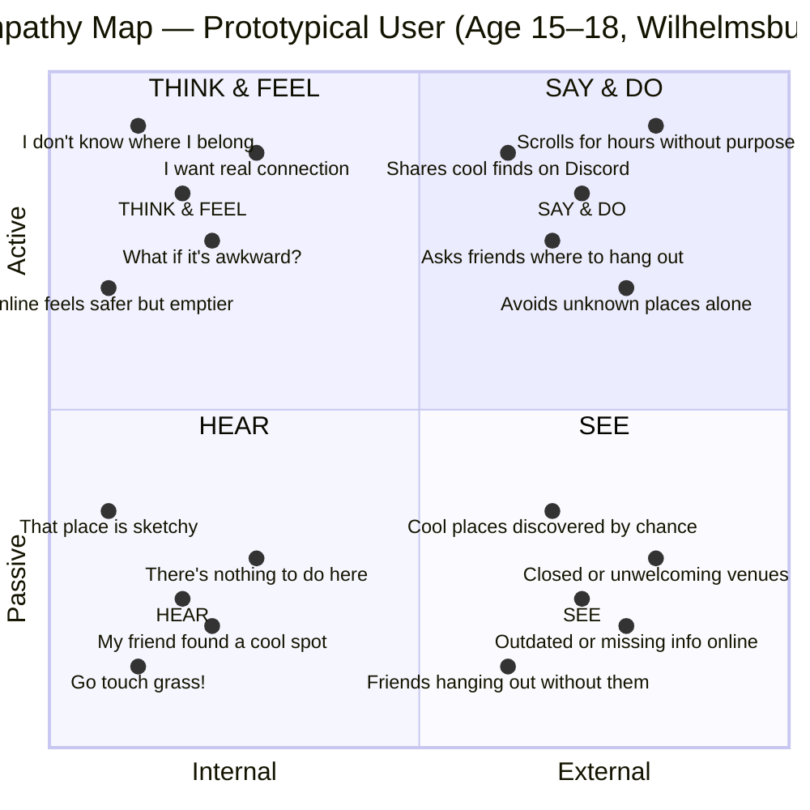

# Empathy Map: Prototypical User
**"A young person in Wilhelmsburg trying to find their place offline"**

---

## 🔴 Pains
- No reliable way to discover safe, free, and welcoming spaces nearby
- Fear of showing up somewhere unfamiliar and feeling out of place
- Information is scattered, outdated, or simply missing
- Many spaces feel implicitly exclusionary (not FLINTA*-friendly, age-inappropriate)
- Too much time spent online as a substitute for offline life

---

## 🟢 Gains
- A single, trustworthy map showing places that are actually relevant to them
- Community reviews that describe the **vibe**, not just the address
- Filters that surface spaces matching their identity and comfort level
- A gentle incentive (check-ins, collections) that makes going out feel rewarding
- The confidence that comes from knowing what to expect before arriving