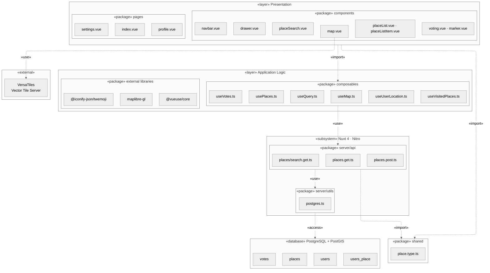

# Package Diagram of a Nuxt App, current version of prototype

```mermaid
---
config:
  layout: elk
  theme: neutral
---
graph TB
  subgraph Shared["«package» shared"]
    PT["place.type.ts"]
  end

  subgraph Presentation["«layer» Presentation"]
    subgraph Pages["«package» pages"]
      P1["index.vue"]
      P2["profile.vue"]
      P3["settings.vue"]
    end
    subgraph Components["«package» components"]
      C1["map.vue"]
      C2["drawer.vue"]
      C3["navbar.vue"]
      C4["placeSearch.vue"]
      C5["placeList.vue · placeListItem.vue"]
      C6["voting.vue · marker.vue"]
    end
  end

  subgraph AppLogic["«layer» Application Logic"]
    subgraph Composables["«package» composables"]
      CO1["usePlaces.ts"]
      CO2["useMap.ts"]
      CO3["useVotes.ts"]
      CO4["useUserLocation.ts"]
      CO5["useVisitedPlaces.ts"]
      CO6["useQuery.ts"]
    end
    subgraph ExtLibs["«package» external libraries"]
      L1["maplibre-gl"]
      L2["@vueuse/core"]
      L3["@iconify-json/twemoji"]
    end
  end

  subgraph Server["«subsystem» Nuxt 4 · Nitro"]
    subgraph API["«package» server/api"]
      A1["places.get.ts"]
      A2["places.post.ts"]
      A3["places/search.get.ts"]
    end
    subgraph Utils["«package» server/utils"]
      U1["postgres.ts"]
    end
  end

  subgraph DB["«database» PostgreSQL + PostGIS"]
    T1["places"]
    T2["users"]
    T3["votes"]
    T4["users_place"]
  end

  subgraph External["«external»"]
    EX1["VersaTiles\nVector Tile Server"]
  end

  Presentation  -. "«import»" .-> Composables
  Presentation  -. "«import»" .-> Shared
  Composables   -. "«use»"    .-> API
  API           -. "«import»" .-> Shared
  API           -. "«use»"    .-> Utils
  Utils         -. "«access»" .-> DB
  C1            -. "«use»"    .-> EX1
```
