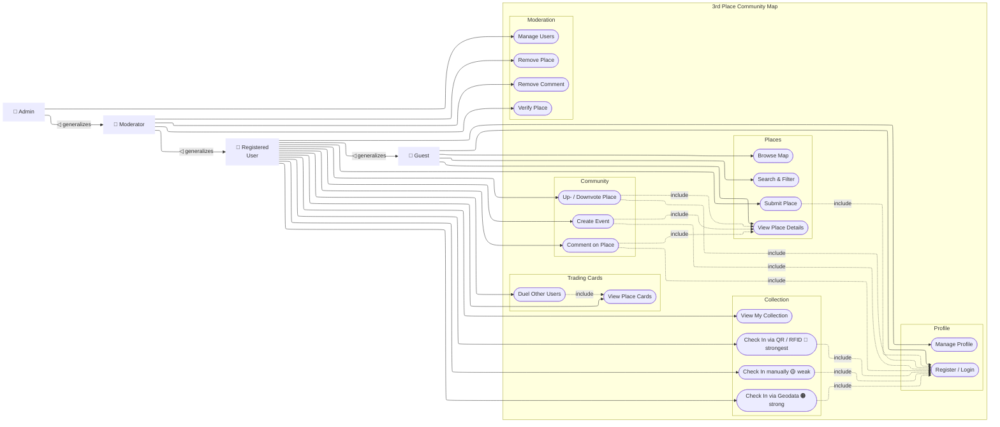

# Requirements

## Use Case Diagram

```mermaid
---
config:
  layout: elk
---

flowchart LR
  rGuest["👤 Guest"]:::role
  rUser["👤 Registered\nUser"]:::role
  rMod["👤 Moderator"]:::role
  rAdmin["👤 Admin"]:::role

  %% Actor generalization: child ──▷ parent (UML hollow triangle convention)
  rUser -->|"◁ generalizes"| rGuest
  rMod -->|"◁ generalizes"| rUser
  rAdmin -->|"◁ generalizes"| rMod

  subgraph S["3rd Place Community Map"]
    direction TB

    subgraph Places["Places"]
      ucBM([Browse Map])
      ucVP([View Place Details])
      ucSP([Submit Place])
      ucSF([Search & Filter])
    end

    subgraph Community["Community"]
      ucVote([Up- / Downvote Place])
      ucComment([Comment on Place])
      ucEvent([Create Event])
      ucVote -. include .-> ucVP
      ucComment -. include .-> ucVP
      ucEvent -. include .-> ucVP
    end

    subgraph Collection["Collection"]
      ucCI_M([Check In manually 🟡 weak])
      ucCI_G([Check In via Geodata 🟠 strong])
      ucCI_Q([Check In via QR / RFID 🔴 strongest])
      ucMyCol([View My Collection])
    end

    subgraph Cards["Trading Cards"]
      ucCardView([View Place Cards])
      ucDuel([Duel Other Users])
      ucDuel -. include .-> ucCardView
    end

    subgraph Moderation["Moderation"]
      ucVerify([Verify Place])
      ucRemovePlace([Remove Place])
      ucRemoveComment([Remove Comment])
      ucManageUsers([Manage Users])
    end

    subgraph Profile["Profile"]
      ucAuth([Register / Login])
      ucProfile([Manage Profile])
    end

    ucSP -. include .-> ucAuth
    ucVote -. include .-> ucAuth
    ucComment -. include .-> ucAuth
    ucEvent -. include .-> ucAuth
    ucCI_M -. include .-> ucAuth
    ucCI_G -. include .-> ucAuth
    ucCI_Q -. include .-> ucAuth
  end

  %% Guest — base actor
  rGuest --> ucBM
  rGuest --> ucVP
  rGuest --> ucSF
  rGuest --> ucAuth

  %% Registered User — own use cases only (inherits Guest's via generalization)
  rUser --> ucSP
  rUser --> ucVote
  rUser --> ucComment
  rUser --> ucEvent
  rUser --> ucCI_M
  rUser --> ucCI_G
  rUser --> ucCI_Q
  rUser --> ucMyCol
  rUser --> ucCardView
  rUser --> ucDuel
  rUser --> ucProfile

  %% Moderator — own use cases only (inherits User's via generalization)
  rMod --> ucVerify
  rMod --> ucRemovePlace
  rMod --> ucRemoveComment

  %% Admin — own use cases only (inherits Moderator's via generalization)
  rAdmin --> ucManageUsers


  classDef role stroke-width:0px;
```