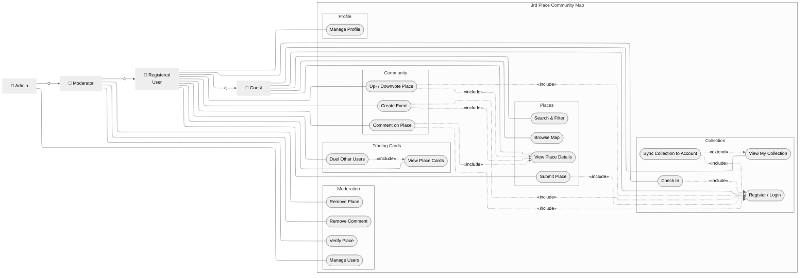

# Requirements

## Use Case Diagram

```mermaid
---
config:
  layout: elk
  theme: neutral
---
flowchart LR
  rGuest["👤 Guest"]:::role
  rUser["👤 Registered\nUser"]:::role
  rMod["👤 Moderator"]:::role
  rAdmin["👤 Admin"]:::role

  rUser -->|"◁"| rGuest
  rMod -->|"◁"| rUser
  rAdmin -->|"◁"| rMod

  subgraph S["3rd Place Community Map"]
    direction TB

    subgraph Places["Places"]
      ucBM([Browse Map])
      ucVP([View Place Details])
      ucSP([Submit Place])
      ucSF([Search & Filter])
    end

    subgraph Community["Community"]
      ucVote([Up- / Downvote Place])
      ucComment([Comment on Place])
      ucEvent([Create Event])
      ucVote -. «include» .-> ucVP
      ucComment -. «include» .-> ucVP
      ucEvent -. «include» .-> ucVP
    end

    subgraph Collection["Collection"]
      ucMyCol([View My Collection])
      ucSyncCol([Sync Collection to Account])
      ucCI([Check In])
      ucSyncCol -. «extend» .-> ucMyCol
      ucSyncCol -. «include» .-> ucAuth
      ucCI -. «include» .-> ucAuth
    end

    subgraph Cards["Trading Cards"]
      ucCardView([View Place Cards])
      ucDuel([Duel Other Users])
      ucDuel -. «include» .-> ucCardView
    end

    subgraph Moderation["Moderation"]
      ucVerify([Verify Place])
      ucRemovePlace([Remove Place])
      ucRemoveComment([Remove Comment])
      ucManageUsers([Manage Users])
    end

    subgraph Profile["Profile"]
      ucAuth([Register / Login])
      ucProfile([Manage Profile])
    end

    ucSP -. «include» .-> ucAuth
    ucVote -. «include» .-> ucAuth
    ucComment -. «include» .-> ucAuth
    ucEvent -. «include» .-> ucAuth
  end

  rGuest --- ucBM
  rGuest --- ucVP
  rGuest --- ucSF
  rGuest --- ucAuth
  rGuest --- ucMyCol

  rUser --- ucSP
  rUser --- ucVote
  rUser --- ucComment
  rUser --- ucEvent
  rUser --- ucCI
  rUser --- ucCardView
  rUser --- ucDuel
  rUser --- ucProfile

  rMod --- ucVerify
  rMod --- ucRemovePlace
  rMod --- ucRemoveComment

  rAdmin --- ucManageUsers

  classDef role stroke-width:0px
```
