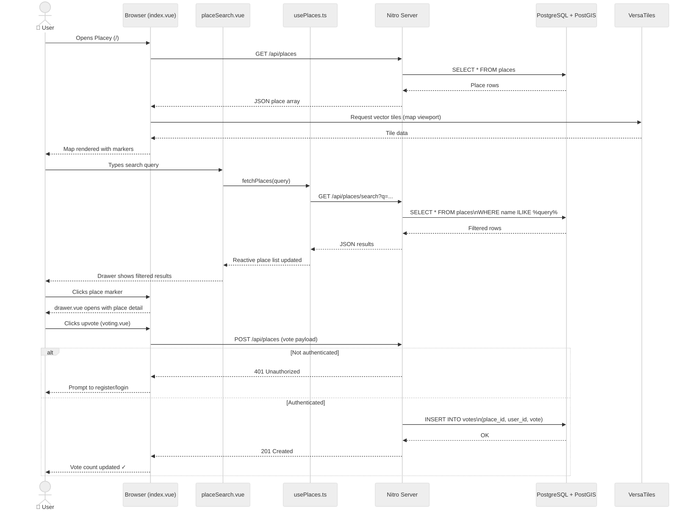

# Sequence Diagram Example, vote on a place

```mermaid
---
config:
  layout: elk
  theme: neutral
---
sequenceDiagram
  actor User as 👤 User
  participant B as Browser (index.vue)
  participant PS as placeSearch.vue
  participant uP as usePlaces.ts
  participant N as Nitro Server
  participant PG as PostgreSQL + PostGIS
  participant VT as VersaTiles

  User->>B: Opens Placey (/)
  B->>N: GET /api/places
  N->>PG: SELECT * FROM places
  PG-->>N: Place rows
  N-->>B: JSON place array
  B->>VT: Request vector tiles (map viewport)
  VT-->>B: Tile data
  B-->>User: Map rendered with markers

  User->>PS: Types search query
  PS->>uP: fetchPlaces(query)
  uP->>N: GET /api/places/search?q=...
  N->>PG: SELECT * FROM places\nWHERE name ILIKE %query%
  PG-->>N: Filtered rows
  N-->>uP: JSON results
  uP-->>PS: Reactive place list updated
  PS-->>User: Drawer shows filtered results

  User->>B: Clicks place marker
  B-->>User: drawer.vue opens with place detail

  User->>B: Clicks upvote (voting.vue)
  B->>N: POST /api/places (vote payload)
  alt Not authenticated
    N-->>B: 401 Unauthorized
    B-->>User: Prompt to register/login
  else Authenticated
    N->>PG: INSERT INTO votes\n(place_id, user_id, vote)
    PG-->>N: OK
    N-->>B: 201 Created
    B-->>User: Vote count updated ✓
  end
```
