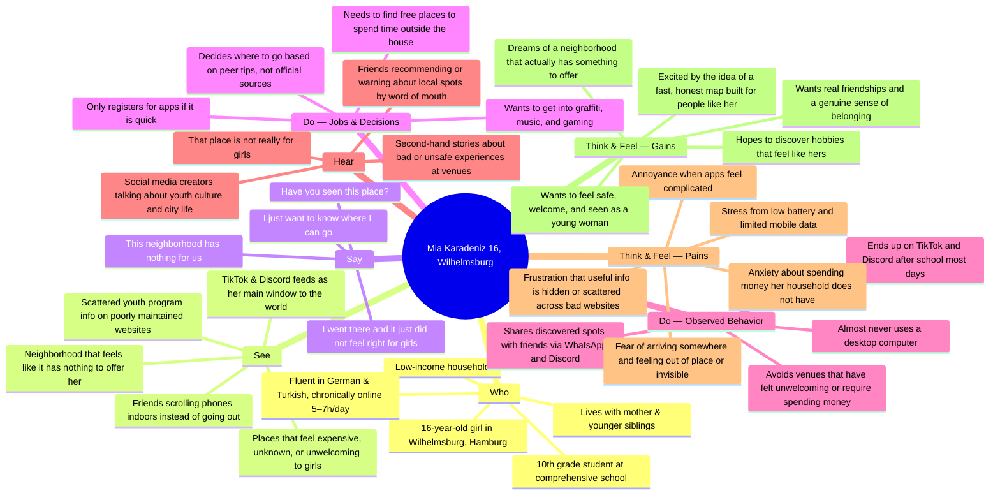
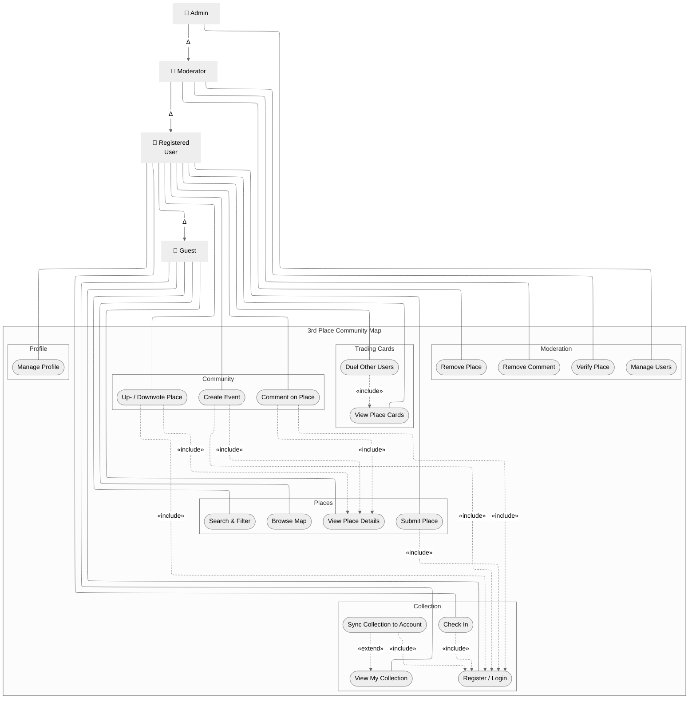
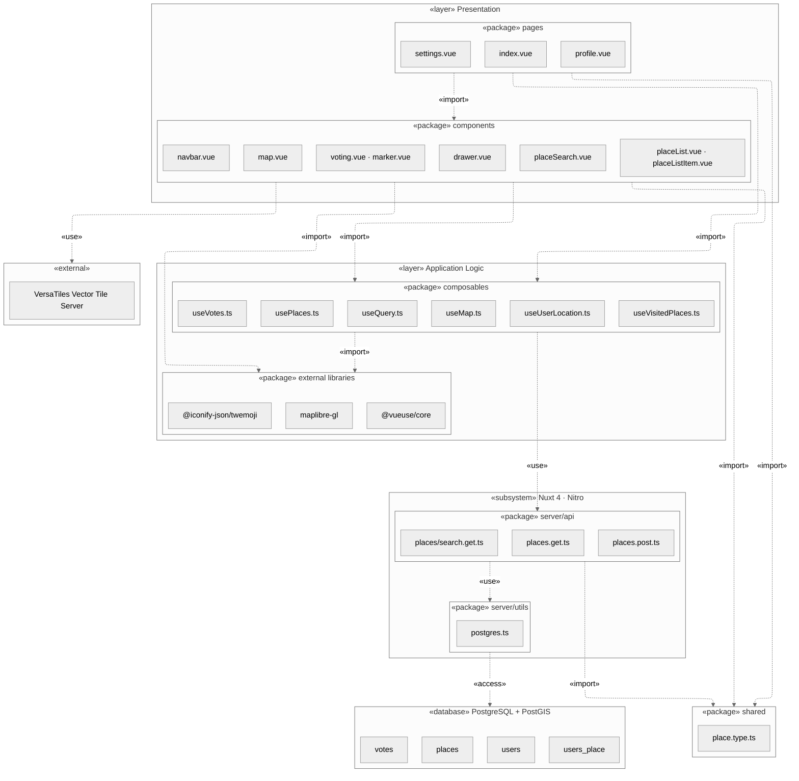
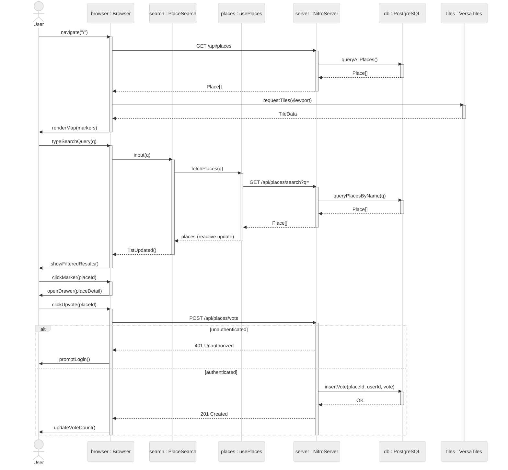

# Requirements-Analysis – Open-Source Map for 3rd Places – Placey

]

## ITECH Software Engineering – Case 1

[**Target Group	1**](#target-group)

[Personas	1](#personas)

[Mia	1](#mia)

[Jonas	2](#jonas)

[User Stories	4](#user-stories)

[Format	4](#format)

[Stories	4](#stories)

[Empathy Map	5](#empathy-map)

[**Architecture	6**](#architecture)

[Unique Selling Point	6](#unique-selling-point)

[Functional Requirements	6](#functional-requirements)

[Problems and Solutions	7](#problems-and-solutions)

[Use Case Diagram	7](#use-case-diagram)

[Framework Architecture	8](#framework-architecture)

[Package Diagram	9](#package-diagram)

[State Diagram	10](#state-diagram)

[Wireframe	11](#wireframe)

[Prototype	11](#prototype)

**Case Description – Provided by Stakeholders**  
**Starting point:** teenagers and young adults currently lack a clear overview of freely accessible places outside of school or work (third places). Existing offers are hard to find or are not perceived as not very inclusive, especially for girls or young women.

**Goal:** a user-driven map-tool which helps teenagers with orientation and access to safe and substance-free spaces in Wilhelmsburg. 

**Functional requirements:**

* Interactive map with listings such as youth centers, libraries, sports clubs, self-organized spaces, etc.  
* Tagging of attributes (e.g., free of charge, FLINTA\*-friendly, age-appropriate)  
* Ability for users to add and edit locations (moderated)  
* Integration of online information, particularly from the Fediverse\* (e.g., references to locations/events)  
* Mobile-optimized use

**Non-functional requirements:**

* Open-source and scalable in the long term  
* Low-threshold, accessible operation  
* Compliant with data protection regulations (GDPR)

---

# Target Group {#target-group}

The app will target teenagers and young-adults and will try to get them to explore their surroundings. Especially people from neighborhoods with a low socioeconomic status, like Wilhelmsburg in Hamburg, shall be reached by the app.

## Personas {#personas}

To further narrow down the target group, we present two personas, Mia and Jonas. This will help us to truly understand some of our archetypical people we are trying to reach. Mia resembles the quick-witted and spontaneous user, while Jonas embodies the methodical and cautious power-user.

### Mia {#mia}

| Age: 16 Gender: Female (she/her) | Demographical group: low income, German-Turk  |
| :---- | :---- |
| Household: Lives with her mother and younger siblings in a rented apartment; mother works part-time. | Education: 10th grade, comprehensive school. |

**Profile:** Mia is a bright 16-year-old who usually ends up on the couch after school, scrolling through TikTok and Discord – not because she really wants to, but because she doesn't know where else to go. She knows the feeling of being invisible in her own neighborhood: many places don't feel made for her – too expensive, too unknown, or simply not welcoming for young women. At the same time, she has a growing desire to make real connections and discover places where she can feel comfortable – without pressure to spend money and without feeling out of place.

**Tech-profile:** old Android smartphone. Internet access primarily over a mobile data plan, home Wi-Fi available but slow. Uses TikTok, Instagram and Discord. Has tried out Mastodon. Often spends up to 7h daily on her phone

| Goals: Meet friends and spend time outside the house – *without spending money* Feel safe and welcome at places in her neighborhood Discover new hobbies (she is interested in graffiti, music, and gaming) Overcome the feeling that Wilhelmsburg "has nothing to offer" | Frustrations: Finds information about youth programs only scattered across poorly maintained websites – or not at all Has visited places multiple times that turned out to be *unwelcoming for girls* Many apps feel like "adult stuff" to her – complicated, ugly, or irrelevant Her battery and mobile data are often running low – apps need to be *fast and data-efficient* |
| :---- | :---- |

| Tech-behaviour: Researches everything thoroughly before committing – reads reviews, checks hours, looks for photos Does not actively use desktop computers Only registers for services if it is quick Enjoys sharing finds with her friend group via WhatsApp and Discord | Mia would use a map for third places if: She immediately understands what she is getting She can see real reviews and comments from other young people The map clearly marks FLINTA\*-friendly places She can easily share places with friends Adding a new location works in under 2 minutes |
| :---- | :---- |

**|** “*I just want to know where I can go – without having to search for an hour first.”*  
**|** “*It showed me the youth center I never knew existed. Now I go there every Tuesday.”*

### Jonas {#jonas}

| Age: 17 Gender: Male (he/him) | Demographical group: low-middle income, German |
| :---- | :---- |
| Household:  Lives with both parents in a mid-sized apartment; father works in logistics, mother is a nurse | Education: 11th grade, comprehensive school. |

**Profile:** Jonas is a quiet, introverted 17-year-old who spends most of his free time at his desk – coding small projects, watching YouTube essays, and playing strategy games online. He has a small group of online friends but struggles to connect with people in real life. He is not antisocial by choice; social situations just feel exhausting and unpredictable to him. Lately, he has been feeling increasingly isolated and has made a private promise to himself to get out more – he just doesn't know how or where to start. The idea of showing up somewhere unfamiliar alone feels paralyzing.

**Tech-profile:** mid-range Android smartphone and laptop. Stable home Wi-Fi and mobile data plan. Uses Reddit, YouTube and Discord. Actively avoids Instagram and TikTok. Sometimes spends more than 6h online. Never actively engages on social media.

| Goals: Find places where he can be around people without pressure to perform socially Ease into offline social life through low-stakes, interest-based activities Discover spaces that feel calm, structured, and predictable (libraries, workshops, gaming clubs) Eventually make at least one real-life friend he can meet regularly | Frustrations: Most youth spaces feel designed for loud, extroverted groups – he feels out of place He has no reliable way to know what the *vibe* of a place is before going Online event listings are either outdated, behind sign-up walls, or hard to find He frequently overthinks visiting somewhere new and ends up not going at all |
| :---- | :---- |

| Tech-behaviour: Researches everything thoroughly before committing – reads reviews, checks hours, looks for photos Prefers text-based information over videos or flashy UI Comfortable with technology; would explore filters and categories in depth Would appreciate seeing what others say about the atmosphere of a place before visiting Might contribute by adding detailed, accurate entries – but only after he trusts the platform | Jonas would use a map for third places if: He can filter places by vibe There are community comments describing the atmosphere, not just opening hours He can browse and plan without having to create an account first The interface feels calm and information-dense – not gamified or loud He can save places to revisit later before deciding to go |
| :---- | :---- |

**|** “*I just need to know it's okay to be there without being 'on' the whole time.”*  
**|** “*I spent weeks meaning to check out that board game café. The map just made me go.”*

## 

## User Stories {#user-stories}

### Format {#format}

**|** “As a *\[persona/user\]*, I want to *\[action\]*, so that *\[goal/benefit\]*.”

### Stories {#stories}

| As a *user*, I want to see an interactive map of third places near me, so that I can get a quick overview of what is available. As a *user,* I want to filter places by properties so that I only see places that are relevant to me. As *Mia*, I want to see which places are marked as FLINTA\*-friendly so that I can feel safe going there without worrying about the atmosphere. As *Jonas,* I want to read community comments describing the vibe of a place, so that I can decide whether it suits my personality before I visit. As *Jonas,* I want to browse the map without creating an account, so that I can explore options without committing to anything upfront. As *Mia*, I want to add a place I discovered to the map, so that other young people in my neighborhood can find them too. As a *user*, I want to see up-to-date information about a place so that I don't show up somewhere that is closed or unsuitable. As a *user,* I want to see events linked to a place, so that I have a reason to visit at a specific time. As a *moderator*, I want to review and verfiy new place submissions, so that the map stays accurate and trustworthy. As *Mia*, I want to register quickly without needing lots of personal data, so that I can participate in the community without barriers.  | As a *user*, I want to upvote or downvote a place, so that the most useful and well-loved spots become more visible. As a *user*, I want to leave a comment on a place, so that I can share my experience with others. As *Jonas*, I want to save places to a personal list, so that I can plan visits without having to find them again on the map. As *Mia*, I want to check in at a place using GPS or a QR code, so that I can collect it and feel rewarded for going out. As *Jonas*, I want to check in manually without GPS if I prefer, so that I can still participate even if I am uncomfortable sharing my location. As *Mia*, I want the app to load quickly on my older phone with a slow connection, so that I am not frustrated before even finding a place. As a *user*, I want the interface to work well on mobile without unintuitive pinches or zooms, so that I can use the map comfortably on the go. As *Jonas*, I want to use the app in a calm and uncluttered interface, so that I do not feel overwhelmed when looking for information. As a *user*, I want to know that my data is handled according to the GDPR, so that I can use the app without worrying about privacy. As *Jonas*, I want to know exactly how and why the app will handle my information, so that I stay in control of my information and make informed decisions. |
| :---- | :---- |

## 

## Empathy Map {#empathy-map}

Looking at Mia's empathy map, a few key insights emerge. Information about youth-friendly places exists, but is currently scattered across poorly maintained websites – confirming that the core problem is not a lack of places, but a lack of reliable aggregation. This is precisely where Placey's value proposition takes hold: a single, up-to-date, community-driven map. Mia already relies on peer recommendations and actively shares discoveries with friends via WhatsApp and Discord, which means that aggregation alone is not sufficient – Placey must also enable users to discuss, rate, and vouch for entries in order to build the trust the target group actually responds to. Finally, mobile performance is a hard acceptance criterion: Mia uses an older Android device on a limited data plan, and any app that loads slowly or consumes excessive data will be rejected before she even reaches the content.

# Architecture {#architecture}

Placey will be a progressive web app built atop the meta framework Nuxt, which is layered above Vue. To manage CSS styles we use the Vue add-on for Tailwind CSS. For the map component we will use MapLibre, which uses the dataset of OpenStreetMaps with vector tiles from VersaTiles. To offer a wide range of icons for user-generated content we utilize Twitter’s Emoji Set. To store our data we will use PostgreSQL and to handle geographical data we use the PostGIS add-on.

## Unique Selling Point {#unique-selling-point}

Placey turns exploring your neighborhood into a game. Users check in at places to collect them, each entry carrying stats that reflect the character of that spot – for example its vibe, accessibility, or community rating. Collected places can be used to challenge other users to duels, turning passive discovery into friendly competition and giving users a concrete reason to keep exploring somewhere new.

## Functional Requirements {#functional-requirements}

Functional Requirements provided by the stakeholders and already listed in the case description will not be reiterated but shall be kept in mind.  
The system shall:

* display an interactive map of third places that any guest can browse without authentication.  
* allow any guest to view the detail page of a place, including its attributes, community comments, and linked events.  
* allow any guest to search and filter places by attribute  
* allow any guest to save a place for future reference.  
* allow registered users to submit new places.  
* allow registered users to upvote or downvote a place from within its detail view.  
* allow registered users to leave comments on a place from within its detail view.  
* allow registered users to create events linked to a place, accessible from its detail view.  
* allow registered users to check in at a place, adding it to their personal collection.  
* allow registered users to view their full collection of checked-in places.  
* generate a place card for each collected place, including stats derived from community data and place attributes.  
*  allow registered users to challenge other users to duels using their collected place cards.  
* allow moderators to verify submitted places.  
* allow moderators to remove places that violate platform guidelines.  
* allow moderators to remove individual comments.  
* allow admins to manage user accounts (e.g., suspend, promote, or remove users).  
* provide a registration and login flow accessible to guests.  
* require authentication as a precondition for submitting places, voting, commenting, creating events, and checking in.  
* allow registered users to manage their profile information.

## Problems and Solutions {#problems-and-solutions}

| Problem | Affected Persona | Solution in Placey |
| :---- | :---- | :---- |
| Information about youth-friendly places is scattered across poorly maintained websites | Mia, Jonas | Single aggregated, community-maintained map as the central entry point |
| Official information is often outdated | Mia, Jonas | User-driven edits with moderation layer to keep entries current and trustworthy |
| No overview of events tied to specific places | Mia, Jonas | Event creation linked to place detail pages, visible to all guests |
| No motivation to actively explore the neighborhood | Mia | Check-in system with place collection and trading card mechanics; duel feature as social incentive |
| Older devices and limited mobile data make many apps unusable | Mia | Mobile-first PWA built on Nuxt with code splitting, lean Tailwind CSS, and vector tiles via VersaTiles |
| Young people rely on peers, not official sources, for recommendations | Mia | Shareable place pages; community ratings and comments as the primary trust signal |
| High-barrier registration discourages casual users from engaging | Mia | Guest browsing without an account; minimal sign-up flow when registration is needed |
| Privacy concerns prevent users from engaging with location-based apps | Jonas | GDPR-compliant data handling; check in of places able without location data. |
| No way to gauge the vibe or atmosphere of a place before visiting | Jonas | Community comments describing atmosphere; upvote/downvote system to signal quality |
| Users have no way to save or plan visits without committing | Jonas | Personal saved list accessible as cookie |
| Unmoderated user content leads to unreliable or harmful entries | Moderator | Moderator tools to verify, remove places and comments |

## Use Case Diagram {#use-case-diagram}

The use case diagram consolidates the functional requirements derived across the preceding sections into a single, structured overview. The four actors (Guest, Registered User, Moderator, and Admin) emerge directly from the personas and user stories: Jonas's explicit need to browse without an account establishes the Guest boundary, while Mia's desire to contribute and collect places defines the Registered User tier, and the moderation requirements from the problems and solutions table introduce the two privileged roles. Each use case can be traced back to at least one user story or functional requirement listed above.  

## Framework Architecture {#framework-architecture}

We have chosen the meta framework Nuxt because it is an opinionated, batteries-included framework that provides essential architectural decisions out of the box, removing setup overhead and letting the team focus on product features from day one. Its tight integration with Tailwind CSS via the official module allows UI components to be built utility-first, resulting in a lean, consistent stylesheet with no unused CSS shipped to the client. Furthermore, Nuxt's built-in support for progressive web app capabilities means Placey can be installed and partially used offline without requiring a separate native app, lowering the barrier to entry for users like Mia who rely on limited mobile data plans.

### Package Diagram {#package-diagram}

The package diagram maps Placey's prototype codebase onto the layered architecture that Nuxt 4 enforces by convention. The topmost Presentation layer is split into two packages following Vue's component model: `pages/` contains the routable entry points generated by Nuxt's file-based router, while `components/` holds the reusable UI fragments – such as the map, drawer, and voting widget – that pages compose together. Below that, the Application Logic layer reflects Vue 3's Composition API: instead of centralizing state in a store, logic is encapsulated in fine-grained composables such as `usePlaces` and `useVotes`, which pages and components both `«import»` independently, keeping concerns cleanly separated without tight coupling. The `shared/` package sits outside any layer and is `«import»`ed by both the frontend and the Nitro server, demonstrating one of Nuxt's key architectural features – a type-safe contract across the client-server boundary enforced by a single shared TypeScript definition. Finally, the Nitro subsystem exposes a thin API layer that `«use»`s a single `postgres.ts` utility to access the PostgreSQL database, keeping all server-side I/O isolated from the Vue application and ensuring that the frontend never holds a direct dependency on the data layer.

### State Diagram {#state-diagram}

The sequence diagram traces four concrete interactions that together cover the core user journey through Placey, illustrating how Nuxt 4's architecture distributes responsibility across the stack at runtime. The initial page load reveals a key characteristic of the framework: the browser makes two entirely independent requests in sequence – one to Nitro's `/api/places` endpoint to fetch place data, and a second directly to VersaTiles for map tiles – demonstrating that Nuxt's server layer handles only application data while the map rendering pipeline bypasses it entirely. The search interaction highlights Vue 3's reactivity model in practice: the user's input propagates inward from `PlaceSearch` to `usePlaces`, which issues a server request and returns a reactive `Place[]` array that automatically propagates back up through the component tree without any manual DOM manipulation. The marker click sequence is intentionally the shortest in the diagram, showing that opening the drawer is a purely client-side state change – no server round-trip is needed – which is a direct consequence of the initial load having already fetched all place data into the composable layer. Finally, the `alt` fragment on the upvote interaction exposes the authentication boundary enforced by Nitro's server middleware: the server is the authoritative gatekeeper, and the client only updates its UI state once a `201 Created` is confirmed, ensuring the displayed vote count always reflects persisted data rather than optimistic client-side assumptions.

## Wireframe {#wireframe}

\[Insert cool Figma UX Images here\]

## Prototype {#prototype}

\[Insert cool Screenshots here\]
